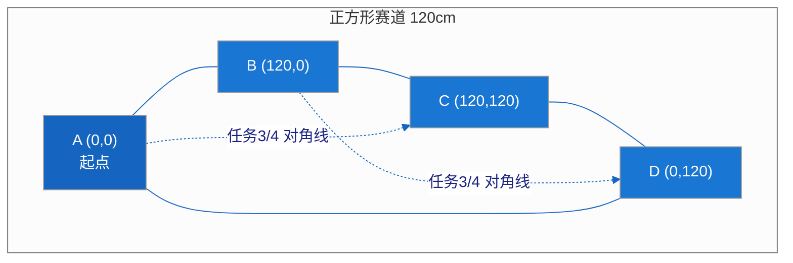
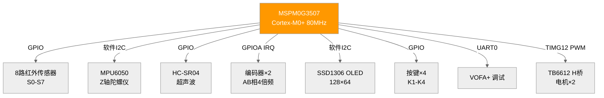
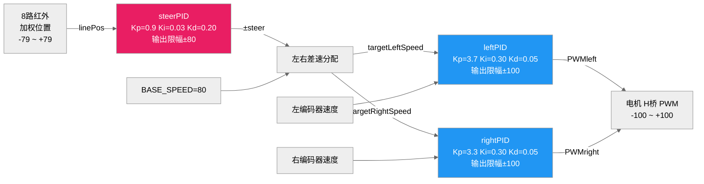
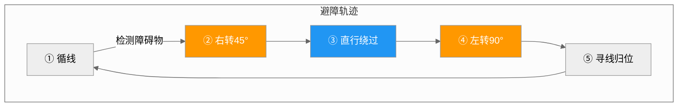
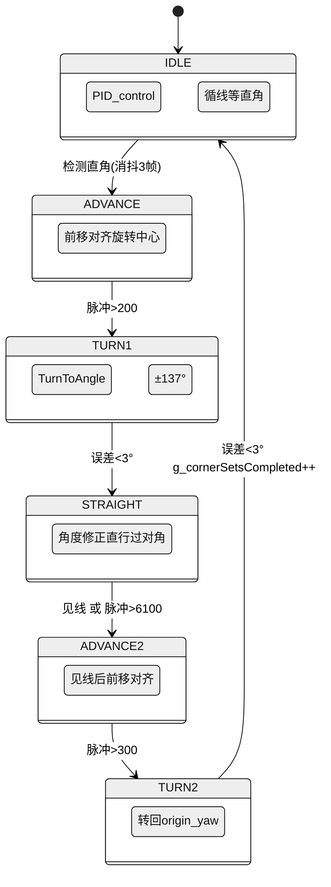
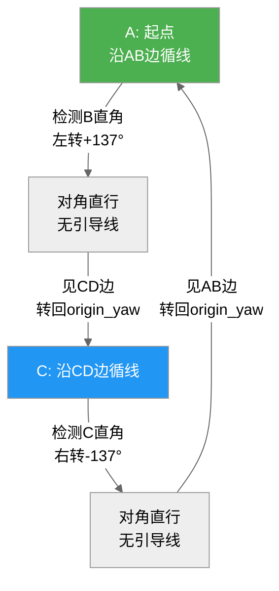

# 电赛校赛智能小车技术报告

## 一、项目概述

本项目基于 TI MSPM0G3507 (ARM Cortex-M0+, 80MHz) 微控制器，在 LP_MSPM0G3507 LaunchPad 上实现了一辆具备循线、避障、对角惯性导航能力的智能小车。系统采用超级循环架构（无 RTOS），以 Keil MDK (ARMCLANG V6.21) 为开发环境，完成电赛校赛规定的四项任务。

### 四项任务

| 任务 | 名称 | 圈数 | 描述 |
|------|------|------|------|
| 1 | 自动寻迹行驶 | 1-5圈可设 | 沿正方形赛道边线纯循线 |
| 2 | 寻迹避障行驶 | 1-5圈可设 | 循线过程中检测并绕行障碍物 |
| 3 | 定点直线+对角线 | 1圈 | 传感器检角+惯性导航沿对角线行驶 |
| 4 | 指定路径多圈 | 4圈 | 与任务3相同算法，执行4圈 |

三项任务共用 `Get_Current_Circles() >= g_targetCircles` 统一停车逻辑。

### 赛道规格

- 正方形赛道，边长 120 cm
- 边线为黑色胶带（白底），供 8 路红外传感器检测
- 对角线无引导线，需依赖陀螺仪+编码器惯性导航



> **四条边线**：黑色胶带（任务1/2 沿边线循迹）
> **两条虚线**：对角线无引导线（任务3/4 惯性导航）

---

## 二、硬件架构

### 2.1 系统硬件框图



### 2.2 主控与传感器

| 模块 | 型号/方案 | 接口 | 说明 |
|------|-----------|------|------|
| 主控 | MSPM0G3507 | — | Cortex-M0+, 80MHz, 128KB Flash |
| 循线传感器 | 8路红外对管 | GPIO | S0-S7 排布，白底返回1，黑线返回0 |
| IMU | MPU6050 | 软件I2C (PA6/PA7) | 6轴，仅用Z轴陀螺仪偏航积分 |
| 超声波 | HC-SR04 | PB8(Trig)/PB15(Echo) | 40kHz，非阻塞测距 |
| 编码器×2 | 增量式AB相 | GPIOA正交解码 | 左右轮独立，4倍频 |
| OLED | SSD1306 128×64 | 软件I2C (PA0/PA1) | 菜单交互与实时数据显示 |
| 按键×4 | 轻触开关 | GPIO | K1急停, K2/K3选择, K4确认 |

### 2.3 驱动与执行

| 模块 | 控制方式 | 说明 |
|------|----------|------|
| 电机×2 | TB6612 H桥 + TIMG12 PWM | -100~+100 占空比，含低速死区补偿 |
| 方向控制 | GPIO H桥 IN1/IN2 | 正转/反转/刹车 |

### 2.4 中断资源分配

| 中断源 | 频率 | 优先级 | 功能 |
|--------|------|--------|------|
| GPIOA (GROUP1) | 事件驱动 | 0 (最高) | 编码器AB相正交解码 |
| TIMA0 | 10ms | 1 | 编码器速度采样 + MPU6050更新标志 |
| TIMG0 (TIMER_US) | 50μs | 2 | 超声波回波脉宽测量 |
| SysTick | 1ms | — | 系统时基 tick_ms |

---

## 三、软件架构

### 3.1 主循环结构

```
main() 超级循环 (无固定周期, ~100-200Hz):
  1. Sensor_GetQuantizedPos()     → 加权位置计算 + 丢线消抖
  2. Ultrasonic_Task()            → 80ms 周期触发测距
  3. g_mpu6050_flag 检查          → MPU6050_UpdateYaw() (TIMA0 10ms驱动)
  4. Handle_Keys()                → 菜单状态机
  5. 任务控制函数                  → PID_control / Avoid / Corner
  6. OLED 显示更新                 → 非阻塞帧刷新
  7. Uart_PollTx()                → 环形缓冲区→UART TX FIFO
```

### 3.2 菜单系统

5 状态状态机：`MENU_MAIN → MENU_TASK_SEL / MENU_SET_LAPS → MENU_RUNNING`

- **MAIN**: 显示当前任务、圈数，K2进任务选择，K3进圈数设置，K4启动
- **TASK_SEL**: K2/K3 切换任务（1↔2↔3↔4 循环），切换时自动配置圈距和速度
- **SET_LAPS**: 仅任务1/2可设圈数(1-5)，任务3/4固定
- **RUNNING**: 实时显示圈数/速度/超声波距离，K1急停
- **MPU_DEBUG**: IMU偏航角实时数值

### 3.3 圈距切换机制

不同任务路径长度不同，需独立标定每圈编码器脉冲数：

| 任务 | 每圈脉冲数 | 圈数来源 |
|------|-----------|----------|
| 任务1 纯循线 | 17500 | 用户设定 |
| 任务2 循线+避障 | 18800 | 用户设定 |
| 任务3 对角线单程 | 21400 | 固定1 |
| 任务4 对角线4圈 | 21400 | 固定4 |

任务切换时自动调用 `Encoder_SetPulsesPerCircle()` 更新圈距。`Encoder_ResetDistance()` 仅在 K4 启动时清零，状态机内部使用脉冲快照差值比较，不破坏累计圈数。

---

## 四、核心算法

### 4.1 PID 控制器体系

系统部署 4 个并联 PID 控制器，参数经实车标定：

| 控制器 | Kp | Ki | Kd | 输出限幅 | 积分限幅 | 用途 |
|--------|-----|-----|-----|----------|----------|------|
| steerPID | 0.9 | 0.03 | 0.20 | ±80 | 40 | 循线转向环 |
| leftPID | 3.7 | 0.30 | 0.05 | ±100 | 80 | 左轮速度环 |
| rightPID | 3.3 | 0.30 | 0.05 | ±100 | 80 | 右轮速度环 |
| anglePID | 1.3 | 0.15 | 0.50 | ±40 | 30 | 航向角度环 |

**PID 特性**：
- 误差一阶低通滤波（α=0.35/0.7），减小编码器抖动
- 抗积分饱和：输出达到限幅且误差方向继续推积分时暂停累加
- `PID_Reset()` 在状态机切换时清零，防止旧积分干扰新阶段

### 4.2 循线控制 (PID_control)



串联双环结构：转向环(位置) → 速度环(编码器) → H桥PWM。

- 传感器 8 路加权位置（-79 ~ +79），目标值 0（线居中）
- 丢线时（5帧消抖确认）：原地差速自转回找，同时逐帧降速（-10/帧）
- 找回线后逐帧恢复速度（+10/帧）至 `g_baseSpeedTarget`

### 4.3 航向保持直行 (PID_control_head)

纯速度环 + 角度修正：以目标航向驱动 anglePID 修正左右差速。用于避障绕行段、对角直行段、前移对齐段。在无循线参考时主动抗跑偏，降低对两轮机械对称性要求。

### 4.4 原地转向 (TurnToAngle)

角度环 + 速度环串联：anglePID 输出→左右轮反向差速→leftPID/rightPID 速度闭环。非阻塞设计，每帧调用一次，由上层状态机判断收敛（角度误差 < 阈值）。

### 4.5 角度差值计算

```c
angle_diff(a, b) → 归一化到 [-180°, 180°]
```
所有角度比较均通过此函数，消除 ±180° 环绕歧义。

---

## 五、MPU6050 航向解算

### 5.1 硬件配置

- 量程：±250 dps (131 LSB/°/s)
- 采样率：100 Hz (SMPLRT_DIV=9)
- DLPF：42 Hz (CONFIG=3)，衰减电机高频振动

### 5.2 软件处理链


**尖峰检测**：相邻两帧原始值差 > 13100 LSB（≈100°/s）视为 I2C 干扰，丢弃当帧（电机 EMI 可能干扰 bit-banged I2C）。

**自适应零偏跟踪**：当角速度 < 0.8°/s（认为未在主动转向），缓慢（α=0.01）将零偏估计向当前滤波值收敛，补偿温度漂移。

### 5.3 定时驱动

MPU6050 更新不依赖主循环频率。TIMA0 ISR 每 10ms 置 `g_mpu6050_flag=1`，主循环检测后调用 `MPU6050_UpdateYaw()`。这种标志位驱动方式确保采样间隔固定，不受主循环速度波动影响。

---

## 六、任务二：避障状态机 (v2)

### 6.1 设计理念

旧版 v1 以固定延时驱动各阶段，电池电压波动导致实际行走距离不一致。v2 全部改用编码器脉冲计距 + MPU6050 非阻塞转角，消除延时依赖。

### 6.2 状态机转换图

```mermaid
%%{init: {'theme': 'neutral'}}%%
stateDiagram-v2
    [*] --> IDLE
    IDLE --> STOP: dist<25cm
    STOP --> TURN_RIGHT: 立即(1帧)
    TURN_RIGHT --> FORWARD: 误差<3°
    FORWARD --> TURN_LEFT: 脉冲>1350
    TURN_LEFT --> SEEK_LINE: 误差<3°
    SEEK_LINE --> IDLE: 找到线 或 超时2500脉冲

    state IDLE { PID_control 正常循线 }
    state STOP { 停车快照 origin_yaw }
    state TURN_RIGHT { TurnToAngle(yaw→+45°) }
    state FORWARD { PID_control_head 直行 }
    state TURN_LEFT { TurnToAngle(-45°) 净左转90° }
    state SEEK_LINE { 寻线归位 }
```

### 6.3 避障轨迹俯视图



### 6.4 6 阶段详情

障碍物在线右侧，小车右转绕行：

```
IDLE(循线) → STOP(停车快照) → TURN_RIGHT(右转45°) → FORWARD(直行绕过)
  → TURN_LEFT(左转90°) → SEEK_LINE(寻线归位) → IDLE
```

| 阶段 | 行为 | 触发条件 |
|------|------|----------|
| IDLE | PID_control 标准循线 | 超声波 dist < 25cm |
| STOP | 停车→记录origin_yaw→快照编码器（1帧） | 立即 |
| TURN_RIGHT | TurnToAngle(yaw → origin_yaw + 45°) | 角度误差 < 3° |
| FORWARD | PID_control_head(60, origin_yaw + 45°) 直行 | 编码器增量 > 1350脉冲 |
| TURN_LEFT | TurnToAngle → origin_yaw - 45° (净左转90°) | 角度误差 < 3° |
| SEEK_LINE | PID_control_head(60, origin_yaw - 45°) 寻线 | is_lost==0 或超时 2500脉冲 |

### 6.5 关键设计

- **脉冲快照计距**：各阶段记录 `g_segmentStartPulses`，比较差值。不调用 `Encoder_ResetDistance()`，累计圈数不受影响。
- **寻线超时保护**：SEEK_LINE 阶段最多走 2500 脉冲（约 38cm）后强制回 IDLE，防止无限寻线。
- **角度积分复位**：FORWARD 直行结束后 `PID_Reset(&anglePID)`，否则直行积累的角度积分会抵抗后续左转。

---

## 七、任务三/四：对角导航状态机 (v2)

### 7.1 设计理念

正方形赛道对角线无引导线。利用 8 路传感器在拐角处一侧全黑的特征检测直角，触发对角穿越序列。检测到直角后原地转 137° 朝对角方向，直行穿越到对边，转 137° 回到原始航向（正方形对边平行），回归循线。2 次拐角 = 1 圈。

### 7.2 状态机转换图



### 7.3 对角导航轨迹俯视图



> 2次拐角 = 1圈（A → B拐角穿越 → C → D拐角穿越 → A）

### 7.4 6 阶段详情

```
IDLE(循线) → ADVANCE(前移对齐旋转中心) → TURN1(转137°朝对角方向)
  → STRAIGHT(直行过对角) → ADVANCE2(见线后前移对齐) → TURN2(转回origin_yaw) → IDLE(计数+1)
```

| 阶段 | 行为 | 触发条件 |
|------|------|----------|
| IDLE | PID_control 循线 | 一侧4灯全黑 + 3帧消抖 |
| ADVANCE | PID_control_head 前移对齐旋转中心 | 编码器增量 > 200脉冲 |
| TURN1 | TurnToAngle(yaw → origin_yaw ± 137°) | 角度误差 < 3° |
| STRAIGHT | PID_control_head 角度修正直行 | 中传感器(S3且S4)见线 或 > 6100脉冲 |
| ADVANCE2 | PID_control_head 见线后前移对齐 | 编码器增量 > 300脉冲 |
| TURN2 | TurnToAngle(yaw → origin_yaw) | 角度误差 < 3°, counts++ |

### 7.5 直角检测

```
S0~S3 全黑 → 左直角 → turnDir = +1 → origin_yaw + 137° (左转/CCW)
S4~S7 全黑 → 右直角 → turnDir = -1 → origin_yaw - 137° (右转/CW)
连续 3 帧消抖防误触
```

### 7.6 传感器物理偏移补偿

8路红外传感器安装在车体前方，旋转中心在车体中部。检角后需**前移 200 脉冲**让旋转中心对准拐角顶点再原地转向。见线后需**前移 300 脉冲**让旋转中心对准对边线段再转回。两组 ADVANCE 阶段消除传感器与旋转中心的物理偏移影响。

### 7.7 TURN2 回正原理

正方形对边互相平行。到达对边后，车身方向与原始方向相差 180°，但线段方向相同。因此只需转回 `origin_yaw` 即可沿下一段继续循线，无需计算复杂的对角航向。

---

## 八、避障与对角导航参数汇总

### 8.1 避障参数

| 参数 | 值 | 说明 |
|------|-----|------|
| AVOID_TURN_DEG | 45° | 右转避开角度 |
| AVOID_RETURN_DEG | 45° | 左转回线角度（净左转 90°） |
| AVOID_DIST_PULSES | 1350 | 绕障直行距离 |
| AVOID_SPEED | 60 | 避障直行速度 |
| AVOID_OBSTACLE_CM | 25 | 超声波检测阈值 |
| AVOID_CONVERGE_THRESH | 3.0° | 转向到位判定 |
| AVOID_SEEK_MAX_PULSES | 2500 | 寻线超时保护 |

### 8.2 对角导航参数

| 参数 | 值 | 说明 |
|------|-----|------|
| CORNER_TURN_DEG | 137° | 转角角度 |
| CORNER_STRAIGHT_PULSES | 6100 | 直行最大距离 |
| CORNER_STRAIGHT_SPEED | 80 | 直行速度 |
| CORNER_ADVANCE_PULSES | 200 | 检角后前移对齐 |
| CORNER_RETURN_ADVANCE_PULSES | 300 | 见线后前移对齐 |
| CORNER_CONVERGE_THRESH | 3.0° | 转向到位判定 |
| CORNER_DETECT_DEBOUNCE | 3 | 直角消抖帧数 |

---

## 九、特色设计

### 9.1 非阻塞状态机

避障和对角导航均采用**编码器脉冲快照 + MPU6050 非阻塞转角**架构，不依赖 `Delay_ms()` 阻塞延时。状态机在主循环中每帧推进一次，`TurnToAngle()` 每帧调用但由上层判断收敛。此设计确保：
- 电池电压变化不影响各阶段实际行走距离
- 状态切换时 OLED 显示和按键响应不受影响
- 丢线消抖等保护机制全程有效

### 9.2 MPU6050 处理鲁棒性

三层抗扰设计：
1. **尖峰检测**：过滤电机 EMI 导致的 I2C 瞬态错误
2. **低通滤波**（α=0.7）：衰减电机高频机械振动
3. **自适应零偏跟踪**：缓慢补偿温度漂移，静置时自动收敛

### 9.3 超声波非阻塞测距

50μs ISR 轮询 Echo 引脚，不占用主循环时间。80ms 周期触发，超时 40ms 自动复位，避免 Echo 引脚异常导致死等。

### 9.4 丢线消抖

5 帧连续全白才确认丢线，防止过弯、晃动、避障回正时传感器瞬间全白误触发自转。

### 9.5 编码器双通道累计

`s_totalCountA/B` 不清零，持续累计供圈数计算；`Get_Encoder_countA/B` 仅用于 10ms 速度差分。两个通道独立，互不干扰。

---

## 十、开发环境

| 项目 | 说明 |
|------|------|
| IDE | Keil MDK 5.x |
| 编译器 | ARMCLANG V6.21 |
| 配置工具 | SysConfig (引脚/外设生成) |
| 调试工具 | VOFA+ FireWater (串口波形显示) |
| 版本管理 | Git (本地仓库) |
| 编码 | UTF-8, 中文注释 |
| 目标频率 | 80 MHz |

---

## 十一、实车标定与调优

### 11.1 PID 参数标定方法

1. 速度环（leftPID/rightPID）：先单独标定，逐步增大 Kp 至轮速跟踪无过冲，再加 Ki 消除稳态误差
2. 转向环（steerPID）：在直线上方摆动次数最小化，Kd 抑制高频振荡
3. 角度环（anglePID）：原地转向测试，Kp 确保转向有力但不振荡，Ki 消除静差

### 11.2 圈距标定

各任务路径长度不同，需独立标定。方法：在对应赛道上跑一整圈，读取编码器累计脉冲值作为圈距。

### 11.3 对角角度标定

`CORNER_TURN_DEG=137°` 经实测微调：理论值 135°（正方形对角线夹角），137° 补偿了轮胎打滑、IMU 积分误差等因素。实际角度需在赛道上反复测试确定。
